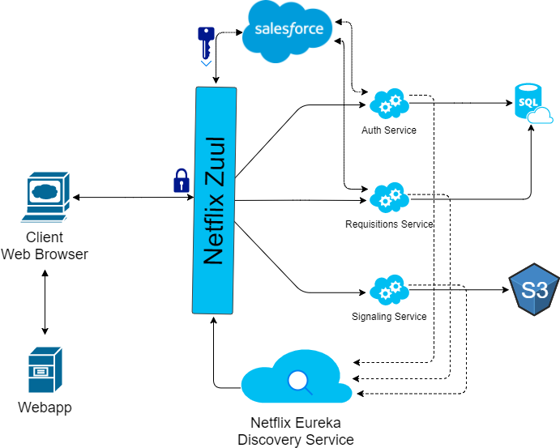

# RIES Documentation 

## Table of Contents
* [**Secure Resource Server**](SecureResourceServerSetup.md)
  * [Resource Server Authentication Setup](SecureResourceServerSetup.md#resource-server-authentication-setup)
  * [How To Use](SecureResourceServerSetup.md#how-to-use)
  * [Allow Anonymous Access](SecureResourceServerSetup.md#allow-anonymous-access)
* [**RIES Security With Spring Security and OAuth2**](RIESSecurity.md#ries-security-with-spring-security-and-oauth2)
  * [TODOs](RIESSecurity.md#todos)

## RIES Microservices Architecture
