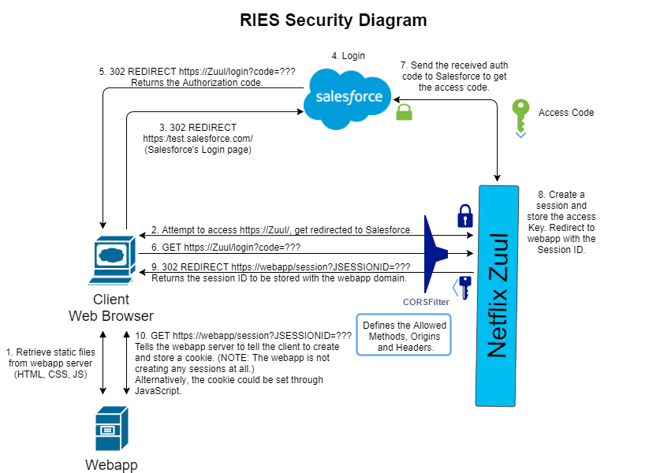

# RIES Security With Spring Security and OAuth2

[Salesforce OAuth2 Documentation](https://developer.salesforce.com/docs/atlas.en-us.api_rest.meta/api_rest/intro_understanding_authentication.htm)
## TODOs
* **CORS Filter** - The preflight request with the HTTP method OPTIONS is not working. The work around was to set the `Content-Type` request header to `text/plain` instead of `application/json`. This will prevent the browser from sending a preflight request in the first place. Because of this, the controller endpoint needs to accept the `@RequestBody` as a String data type and deserialize it into a POJO manually. An example of this can be found at `ries-auth-service` under the `createGuest()` method. The guest infomation is accepted as a String and GSON is used to deserialize it into the Guest POJO.
* **Salesforce OAuth2** - The `Force.java` was developed initially under `ries-proxy-gateway`. It was used to simplify user data retrieved from Salesforce. The `Employee` and `Role` POJOs were used to represent the simplified Salesforce data. This Salesforce utility was required by other services to check for authorization. Thus, the source code was copied across to those projects. Ideally, these utility functions could be packaged into one jar file and synchronized across to the projects. This will prevent duplicate sorce code, even if it is across projects. (Packaging it into a jar file is only a suggestion)
* **Salesforce Revoke Access Token** - Even if the user session is deleted from Zuul, Salesforce will still remember that the user is still logged in. This prevents the user from logging off of Salesforce and switching accounts. The request to Salesforce is returning a 400 Bad Request response. Send a proper request to Salesforce to revoke the access token. Look into `ries-proxy-gateway/../config/SalesforceLogoutHandler`.
* **CSRF Token** - Adds an additional layer of security. Form submissions should provide a CSRF token as an input parameter.